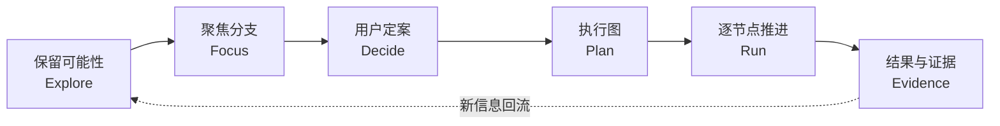
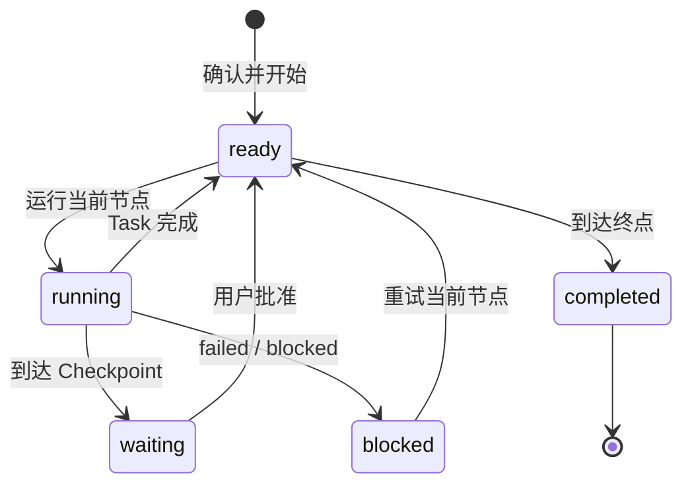
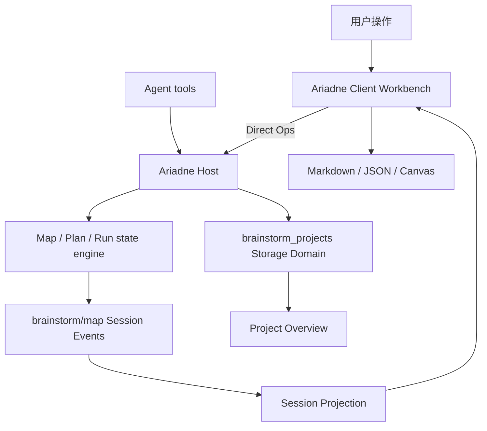

<div align="center">
  

  <h1>引线 / Ariadne</h1>

  <p><strong>把复杂讨论里的方向、取舍与执行，接成一条可回看、可推进、可恢复的线。</strong></p>
  <p>A visual decision workbench for DeepSeek Harness.</p>

  <p>
    <a href="https://github.com/Zayzz-pixel/dsh-ariadne/releases/latest"></a>
    <a href="https://github.com/topics/dsh-plugin"></a>
    
    
    <a href="LICENSE"></a>
  </p>

  <p>
    <a href="#60-秒安装">安装</a> ·
    <a href="#一条完整的线">核心闭环</a> ·
    <a href="#工作台由什么组成">功能</a> ·
    <a href="#架构与数据">架构</a> ·
    <a href="#验证记录">验证</a> ·
    <a href="https://github.com/Zayzz-pixel/dsh-ariadne/releases/tag/v0.3.0">v0.3.0</a>
  </p>
</div>

> [!NOTE]
> **“引线”来自阿里阿德涅交给忒修斯的线。** Ariadne 让探索保有广度，也让最终选择拥有一条明确的执行路径。

## 一眼看懂

Ariadne 工作在 DSH 会话里。Agent 负责维护结构，用户始终掌握聚焦、暂缓、定案和执行节奏。

| 你正在做什么 | Ariadne 保存什么 | 下一步能做什么 |
| --- | --- | --- |
| 发散讨论 | Topic、一级方向、子分支与状态 | 继续展开、整理结构、暂缓方向 |
| 聚焦一个分支 | 当前理解、待解决、下一步、个人笔记 | 深挖、比较同级、收敛子方向 |
| 做出取舍 | 定案池与未覆盖事项 | 生成可审阅的执行图 |
| 推进工作 | Task / Decision / Checkpoint 与 Execution Run | 每次只运行当前节点 |
| 完成一轮 | 摘要、证据、产物引用与路线结果 | 恢复、重试、继续或回到探索 |

## 一条完整的线



这条闭环是 Ariadne 的产品边界：

1. 对话中持续保留真实出现的方向。
2. 用户主动选择当前焦点，Agent 维护工作摘要。
3. 候选方向进入定案池，由用户确认执行范围。
4. Agent 生成显式的 Task / Decision / Checkpoint 图。
5. 用户按节点触发执行，结果和证据写回同一个 Run。

## 60 秒安装

安装固定版本：

```sh
dsh plugin --profile web add github:Zayzz-pixel/dsh-ariadne#v0.3.0
dsh web
```

安装完成后，新会话顶部会出现：

```text
对话  ·  轨迹  ·  引线
```

进入 **引线**，打开工具栏开关，当前 Session 的 Agent 才会获得 Ariadne 的四个工具。

本地开发链接：

```sh
dsh plugin --profile web add "link:$(pwd)"
dsh web
```

卸载：

```sh
dsh plugin --profile web remove dsh-ariadne
```

## 工作台由什么组成

| 表面 | 作用 | 用户掌握的动作 |
| --- | --- | --- |
| **会话地图** | 把 Topic、一级方向与纵深关系外化成可操作结构 | 拖拽、缩放、折叠、聚焦、编辑、导出 |
| **Focus Dock** | 围绕当前节点保留结构导航、工作摘要和个人笔记 | 展开、探索、定案、暂缓、带入本轮 |
| **Session Frame** | 固定本轮目标与组织口径 | 直接编辑 Goal 与 organizing principle |
| **定案池** | 把“值得做”从“已经聊过”中分离出来 | 搜索、筛选、加入、移出、重新取舍 |
| **Execution Graph** | 用显式依赖表达执行顺序和分支条件 | 审阅工作包、编辑规格、切换列表/图 |
| **Project Overview** | 聚合同一工作区里的持久 Session Map | 创建项目、移动会话、刷新总图、继续探索 |

### 探索与定案

1. 空地图提供 **展开一个想法** 与 **整理已有内容** 两个入口。
2. 新想法先确定目标与拆解口径，再生成 4–7 个暂定一级方向。
3. 已有长对话只提取真实出现的层级、未解决问题和暂缓方向。
4. 点选地图节点后，Focus Dock 保存“当前理解 / 待解决 / 下一步”。
5. **小范围自动探索** 最多补充 5 个直接子节点，只展开下一层。
6. 在执行视图调整定案池，再让 Agent 生成执行图。

### 我的笔记

`userNote` 与 Agent 共享的 `note` 分开保存：

- 输入过程不反复追加 Session Event。
- 点击保存或按 `⌘/Ctrl + Enter` 时提交一次。
- 只有点击 **带入本轮**，个人笔记才进入 Agent 当前上下文。
- Agent 更新共享摘要时保留个人笔记原文。

## 三种执行节点

Final Plan v2 只保存一份 `graph`。列表视图和图视图都从这份权威结构派生。

| 节点 | 什么时候使用 | 如何推进 |
| --- | --- | --- |
| **Task / 任务** | 一个可独立验收的工作包 | 成功沿 `success` 边进入下一节点 |
| **Decision / 判断** | 结果会改变后续路线 | Agent 返回允许列表中的精确 `routeKey` |
| **Checkpoint / 检查点** | 需要用户审阅或批准 | 用户点击 **批准检查点** 后推进 |

执行图采用单节点、无环控制流，建议 5–20 个节点，硬上限 30 个。每个定案方向都要被工作包引用，或在 `uncovered` 中记录缺口与原因。

### Execution Run



Run 会保存当前节点、状态、执行次数、摘要、证据和产物引用。刷新页面后，同一 Run 会从持久会话事件中恢复。

<details>
<summary><strong>失败、恢复与退出规则</strong></summary>

- Task 或 Decision 返回 `failed` 时，有 `failure` 边就进入处理节点；其余情况停在 `blocked`。
- 入队失败会尝试把当前节点恢复为 `ready`，并保留已有执行次数。
- Agent 已空闲而节点仍为 `running` 时，可手动恢复为待运行。
- 取消 Run 会保留计划和已有产物；重新开始会创建新的 Run。
- 返回探索会清除当前 Plan / Run，保留定案池和历史 Session Event。
- 活动 Run 处于 `ready`、`running`、`waiting` 或 `blocked` 时，引线开关保持锁定。

</details>

## Agent 工具

| 工具 | 职责 |
| --- | --- |
| `brainstorm_map` | 增量维护地图、节点记录、Session Frame 与定案池 |
| `brainstorm_project` | 从持久 Session Map 刷新项目总图 |
| `brainstorm_plan` | 根据定案池生成 Final Plan v2 执行图 |
| `brainstorm_execution_complete` | 提交当前运行节点的结果、路线、证据与产物引用 |

关闭当前 Session 的引线后，这四个工具会从该 Session 的模型工具目录移除。活动 Run 中的 Agent 只处理当前节点。

## 架构与数据



| 数据 | 权威位置 | 说明 |
| --- | --- | --- |
| 地图、个人笔记、Plan、Run | `brainstorm/map` Session Event | 完整快照，可回放 |
| 项目元数据 | `brainstorm_projects` Storage Domain | 跨 Session 聚合 |
| 浏览器布局偏好 | 当前 Session Map | 节点位置、尺寸、Focus Dock 状态 |
| Agent 可见工具 | Session scope | 由引线开关即时限制 |

### 改名兼容

0.3.0 起，产品名和安装包名统一为 **引线 / Ariadne** 与 `dsh-ariadne`。现有数据协议继续使用以下稳定标识：

- `brainstorm/map`、`brainstorm/project`
- `brainstorm_*` Agent 工具
- `brainstorm-map` 设置命名空间
- `brainstorm-map.md`、`brainstorm-map.canvas`、`brainstorm-execution.*` 默认导出名

旧会话地图、项目、Final Plan 与 Execution Run 可以直接恢复。旧 Final Plan v1 会在读取时转换为线性 Task 图，历史事件保持原值。

## 导出

| 操作 | 产物 |
| --- | --- |
| 导出地图 | `brainstorm-map.md` |
| 导出 Canvas | `brainstorm-map.canvas`（JSON Canvas 1.0） |
| 导出执行图 | `brainstorm-execution.json` + `brainstorm-execution.md` |

地图导出包含个人笔记；执行图只包含共享记录。执行 Markdown 附带 Mermaid 流程图，JSON 保存 Graph、来源上下文、Frame、未覆盖事项以及 Run 结果。

## 验证记录

`v0.3.0` 发布前完成了以下检查：

| 验证 | 结果 |
| --- | --- |
| `node --check` + `node --test` | **119 项通过** |
| npm 打包 | 12 个发布文件，约 84 kB |
| DSH bundle 组合 | `# == dsh-ariadne` 正确进入 Web profile |
| GitHub 固定标签安装 | `github:Zayzz-pixel/dsh-ariadne#v0.3.0` 成功 |
| 供应链检查 | 安装锁文件检查通过 |
| 标准卸载 | 依赖与 bundle 层均正确移除 |

发布资产：[dsh-ariadne-0.3.0.tgz](https://github.com/Zayzz-pixel/dsh-ariadne/releases/download/v0.3.0/dsh-ariadne-0.3.0.tgz)<br>
SHA-256：`47f39acdde4f140787e76046806ab114e98752a3207d49c72e48c341316a38a9`

## 当前边界

- 兼容 DeepSeek Harness `0.1.1-rc.2` 与 Web profile。
- Node.js 18 及以上。
- 执行由用户逐节点触发。
- 执行图支持 Task、Decision、Checkpoint、成功边、失败边与路线边。
- 图内并行、循环、子图和多 Agent 路由留给后续版本。
- DSH 升级后需要重新检查工具、队列、持久化和客户端加载接口。

## 常见问题

| 现象 | 检查 |
| --- | --- |
| 看不到“引线”标签页 | 确认安装在 `web` profile，完整重启 `dsh web` |
| Agent 看不到四个工具 | 打开当前 Session 的引线开关 |
| 执行按钮不可用 | 等待 Agent 与消息队列空闲，检查当前节点状态 |
| 无法关闭引线 | 先取消活动 Run，或返回探索 |
| 旧会话没有恢复 | 确认会话仍包含 `brainstorm/map` 事件，并使用兼容 DSH 版本 |
| Project Overview 为空 | 先为 Session 建图并归属到当前 Project |

## 开发

```sh
npm run check
DSH_SESSION_JSONL=/absolute/path/session.jsonl.zstd npm run validate:map
node scripts/benchmark.mjs
```

- `npm run check`：语法检查与完整 Node 测试。
- `validate:map`：读取最新持久地图并验证状态不变量。
- `benchmark.mjs`：覆盖 20/30 节点执行图、31/100/200 节点地图与 50 Session 场景。

版本变化见 [CHANGELOG.md](CHANGELOG.md)。发布记录见 [Releases](https://github.com/Zayzz-pixel/dsh-ariadne/releases)。

<details>
<summary><strong>English overview</strong></summary>

Ariadne is a visual decision workbench for DeepSeek Harness. It keeps exploration visible, lets the user focus and select directions, turns those choices into an explicit Task / Decision / Checkpoint graph, and advances one reviewed node at a time.

```sh
dsh plugin --profile web add github:Zayzz-pixel/dsh-ariadne#v0.3.0
```

The current release targets DSH `0.1.1-rc.2`, the Web profile, and Node.js 18+.

</details>

## License

[MIT](LICENSE) © zhouzhizhe

<div align="center">
  <sub>Keep the map wide. Keep the choice yours. Follow the thread.</sub>
</div>
